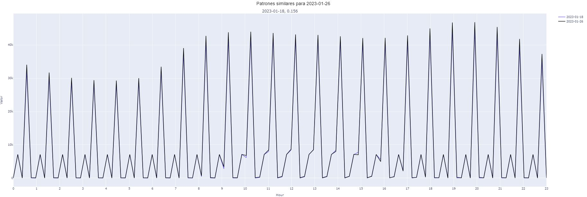

# stumpy_tools

Project done by: 

|Name                         | Email                              |
|---------------------------- |------------------------------------|
|Diego Sanz-Gadea Sánchez     | d.sanz-gadea@alu.icai.comillas.edu |

Time Series Analysis using STUMPY LIBRARY patterns detection through subsequences of a sequence. Computing the Euclidian Distances.

    S.M. Law, (2019). STUMPY: A Powerful and Scalable Python Library for Time Series Data Mining. Journal of Open Source Software, 4(39), 1504.
    

## Use Example
Starting from a Time Series DataFrame `df`


Instanciating the class `SimilarPattern`

```python
patterns=SimilarPattern(df,24)
```

- If the DataFrame inserted has several columns a stacked proccess computes the `2D array into 1D`, pivoting the columns registers to only one column, increasing registers number. Otherwise the sequence is a simply one, so the pattern is not taking into account other variables. Just one, the given. 
- The second argument indicates the period of the subsequence to be compute. For 2D (several column DataFrame). Hidely the subsequence distancees computes as `24*nº columns`

Once created the SimilarPattern object, the methods arises. Firstly with `.get_similar_patter(date)`

```python 
patterns.get_similar_pattern('2023-01-26')
```

```python
['2023-01-18']
```
```python
model.fit( X_train, y_train, X_prev)
```


The most similar date subsequence is shown. Sometimes some dates cant compute similarities. It depends on the data. 

```python
pattern.plot_similar_pattern('2023-01-26')
```



`Motifs` are stored as an attribute when some method using date is computed previously

```python
pattern.seek_motif
```


Also the overall matrix profile could be compute as:

```python 
pattern.get_matrix_profile()
```


## Citations

    S.M. Law, (2019). STUMPY: A Powerful and Scalable Python Library for Time Series Data Mining. Journal of Open Source Software, 4(39), 1504.


